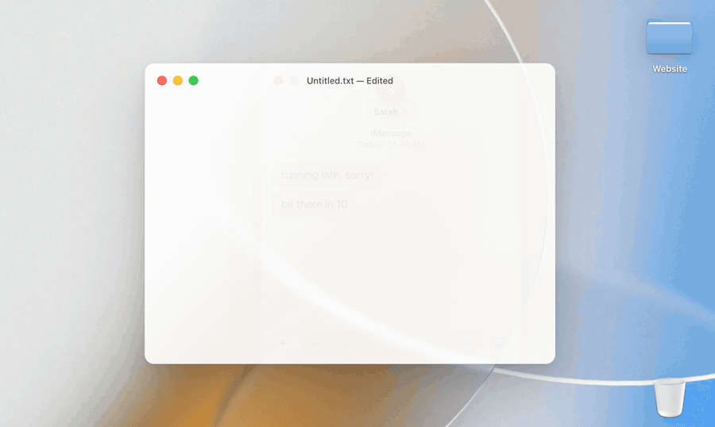

# Mojito

Type emoji shortcodes anywhere on macOS. `:tada:` becomes 🎉 in any text field.

<picture>
  <source media="(prefers-color-scheme: dark)" srcset="docs/demo-dark.gif">
  
</picture>

Requires macOS 14 or later.

> [!TIP]
> Did you find my work useful? [Your support](https://buymeacoffee.com/wellsworkshop) helps fund future projects. Thank you!

## Install

Download the latest DMG from the Releases page and move Mojito to Applications, or install with Homebrew:

```bash
brew install --cask wr/tap/mojito
```

The app walks through granting Accessibility and Input Monitoring access on first launch. Updates arrive automatically — when one is ready, the menu-bar icon shows a badge.

## How it works

After you type a colon and a character or two, a picker shows up next to your cursor with fuzzy matches. Arrow keys move the selection; Return or Tab inserts. To skip the picker, type the closing colon — `:heart:` — and the exact match goes in directly.

Type `:?` to pull up your favorites, with a row to browse every emoji in a grid.

Other things it does:

- Ranks results by how often you use them
- Recognizes emoticons like `:)` and `<3`, and converts text arrows (`->` → →, `<->` → ↔)
- GIF search — type `:::` and a query to drop in a GIF, powered by GIPHY
- Optional symbols and signs: hundreds of them, from `:cmd:` for ⌘ and `:star:` for ★ to currency, arrows, math, and Greek letters
- Default skin tone
- Stays out of apps and websites with native emoji input — Slack, Discord, and a long list of others are excluded out of the box. You can edit the list, or flip it into allowlist mode so Mojito runs only where you say.
- Pause for an hour or until tomorrow, from the menu bar or a keyboard shortcut you set

## Privacy

Mojito reads keystrokes to recognize shortcodes. That happens on your Mac — nothing you type is logged, stored, or sent anywhere, and password fields are skipped entirely.

Mojito can share **anonymous usage stats** to help guide what gets built: counts of popular emoji, which features you have switched on, your macOS and app version, and your language and skin-tone preference. It never includes anything you actually type. You're asked once, you can turn it off anytime in Settings, and the whole dataset is public at [mojito.wells.ee/stats](https://mojito.wells.ee/stats). It's sent at most once a day, carries no identifier, and the server discards your IP. (Dev builds never send it.)

So the only times Mojito reaches the network are the update check, a GIF search when you run one, and — if you leave stats on — that once-a-day anonymous ping.

## Translations

Available in English (US + UK), German, Spanish (Spain + Latin America), French, Italian, Brazilian Portuguese, Japanese, Simplified and Traditional Chinese, Korean, Hindi, Russian, Polish, Dutch, Arabic, Farsi, and Hebrew. The non-English strings start as LLM drafts and improve as native speakers review them — corrections are very welcome.

To contribute, edit `Resources/Localizable.xcstrings` (open it in Xcode for the catalog editor, or edit the JSON directly), then open a pull request. Preserve `%@` / `%lld` placeholders, Markdown like `**bold**`, and backticked code samples like `` `:tada:` `` exactly as they appear in the source string.

To preview a locale without changing your Mac's system language:

```bash
scripts/run-locale.sh fr   # or de, ja, ar, zh-Hans, etc.
```

## Credits

emojibase, Sparkle, KeyboardShortcuts, GIPHY, and a Swift port of fzy.

## License

[AGPL-3.0](LICENSE). © 2026 Wells Riley.
