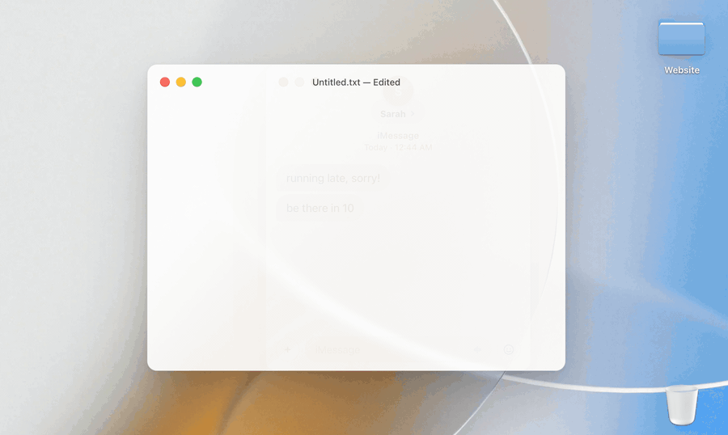

<h1 align="center"> Mojito</h1>

<p align="center">
  <strong>Autocomplete <code>:emoji:</code> everywhere on your Mac.</strong><br>
  Type <code>:</code> to search any emoji, symbol, or GIF in seconds.
</p>

<p align="center">
  <a href="https://mojito.wells.ee/download?ref=github&at=readme"><strong>Download for macOS</strong></a> ⬪
  <a href="https://mojito.wells.ee">Website</a> ⬪
  <a href="#privacy">Privacy</a> ⬪
  <a href="#donate">Donate</a>
</p>

<p align="center">
  <picture>
    <source media="(prefers-color-scheme: dark)" srcset="docs/demo-dark.gif">
    
  </picture>
</p>

## Install

[Download the DMG](https://mojito.wells.ee/download?ref=github&at=readme) and drag Mojito to Applications, or use Homebrew:

```bash
brew install --cask wr/tap/mojito
```

Free and open source. Requires macOS 14 or later. On first launch Mojito walks you through granting Accessibility and Input Monitoring, and it updates itself from then on.

## Use it

| Type | To get |
|---|---|
| `:tada` | 🎉 Emoji, using the Slack and GitHub shortcodes you already know |
| `::cmd` | ⌘ Symbols: arrows, math, currency, and more |
| `:::cats` | GIFs from KLIPY, pasted where you're typing |
| `:?` | Your favorite and most-used emoji |

Arrow keys pick, Return or Tab inserts, Esc dismisses. Type the closing colon (`:heart:`) to skip the picker. Every trigger is customizable in Settings.

- **Learns your favorites:** results re-rank by what you pick.
- **Your skin tone, every time:** set a default once.
- **Emoticons convert too:** `:D` → 😃, `<3` → ❤️, `->` → →.
- **Custom aliases:** make `:fart` mean 💨.
- **Works in every app:** and skips the ones with their own shortcodes (Slack, Discord, Notion, GitHub), plus terminals and code editors. Edit the list in Settings → Exclusions.
- **Speaks 19 languages:** with localized shortcodes in 14 of them, so `:fuego` works in Spanish.

## Privacy

What you type stays on your Mac.

- Keystrokes are never logged or uploaded, and password fields are ignored.
- After `:::`, only your search words and country go to KLIPY.
- Anonymous daily usage counts help guide what gets built. You're asked once, can opt out anytime, and the whole dataset is public at [mojito.wells.ee/stats](https://mojito.wells.ee/stats).

Full details: [mojito.wells.ee/privacy](https://mojito.wells.ee/privacy).

## Translations

Corrections from native speakers are very welcome. The non-English strings started as LLM drafts.

Edit `Resources/Localizable.xcstrings` (Xcode's catalog editor or the raw JSON) and open a pull request. Keep `%@` / `%lld` placeholders, `**Markdown**`, and backticked samples like `` `:tada:` `` exactly as they appear in the source. Preview a locale without changing your system language:

```bash
scripts/run-locale.sh fr
```

## Donate

Mojito is free, with no trial, ads, or upsells. If it saves you time, [buy me a coffee](https://buymeacoffee.com/wellsworkshop).

## Credits

emojibase, [Emoogle](https://github.com/xitanggg/emoogle-emoji-search-engine), Sparkle, KeyboardShortcuts, KLIPY, and a Swift port of fzy.

## License

[AGPL-3.0](LICENSE). © 2026 Wells Riley.
